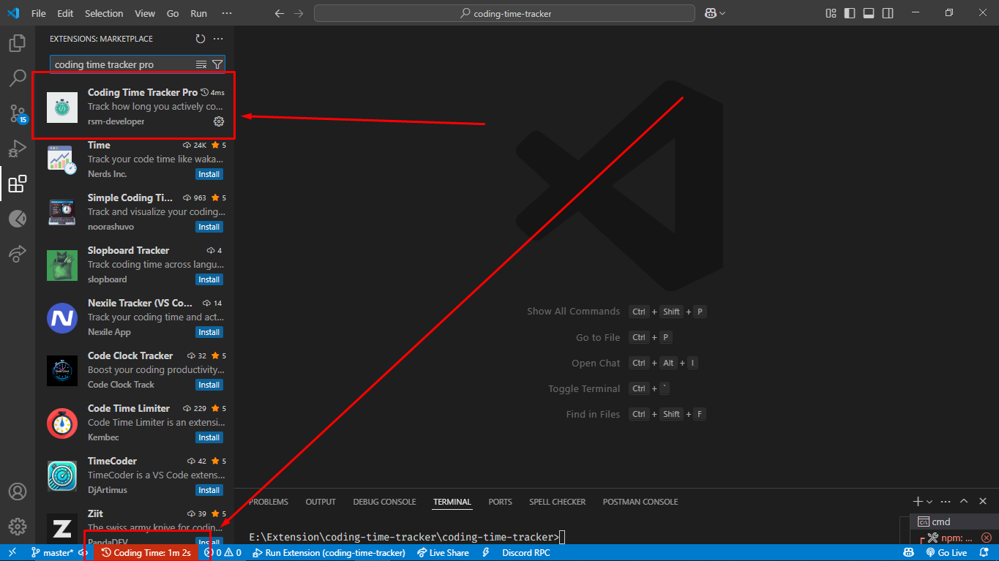

# ⏱️ Coding Time Tracker

A simple yet effective VS Code extension that tracks how much time you spend coding every day!

## ✨ Features

- ⏱️ **Tracks coding time in real-time**
- 💤 **Ignores idle time** (default 60 seconds, configurable)
- 📆 **Resets daily**
- 🔔 **Notifies after 1 hour of coding**
- 📊 **Sidebar Panel** for upcoming visual weekly/monthly stats

## 📸 Status Bar UI

Displays your total coding time on the VS Code status bar with a background color to help you stay aware.

## ⚙️ Configuration

You can change the idle timeout threshold from your VS Code settings:

```json
{
  "codingTimeTracker.idleThreshold": 90
}
